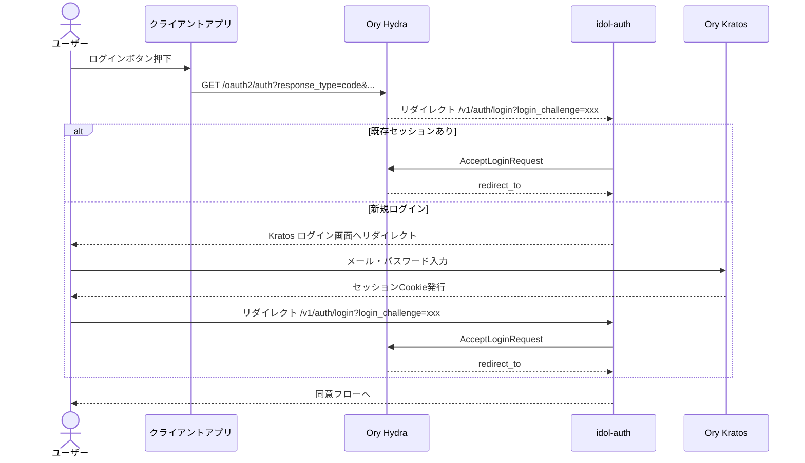
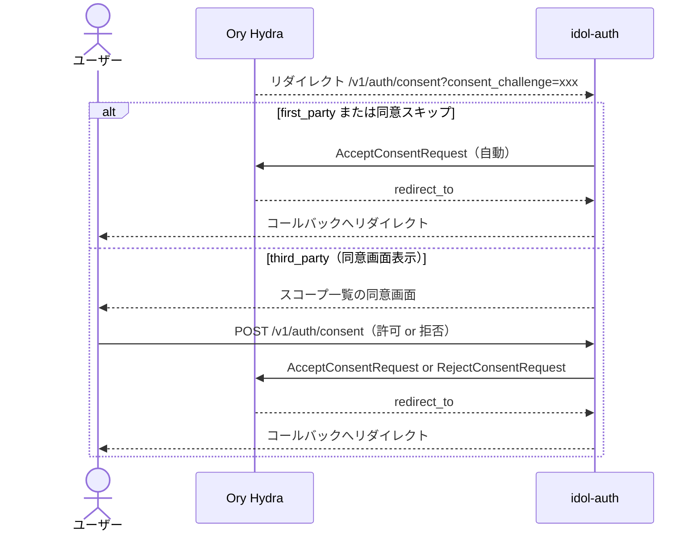
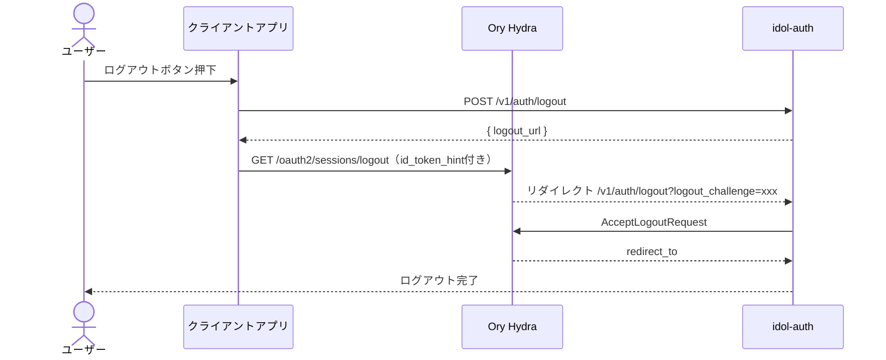

# OIDCフロー（ブラウザ）

ブラウザアプリ・SPA・ネイティブアプリで使う OAuth2 Authorization Code + PKCE フローの詳細解説です。

## 全体像

```
ユーザー → クライアントアプリ → Hydra → idol-auth → Kratos
```

idol-auth は Hydra（OAuth2サーバー）と Kratos（IDサーバー）の間を仲介するブリッジとして動きます。

## 1. ログインフロー



## 2. 同意フロー（Consent）

first_party アプリはスキップされます。third_party アプリは同意画面が表示されます。



## 3. ログアウトフロー



SDK でのログアウト実装:

```typescript
const logoutUrl = client.browserLogoutUrl({
  idTokenHint: idToken,
  postLogoutRedirectUri: 'https://myapp.example.com/',
})
window.location.href = logoutUrl
```

## PKCE の実装

公開クライアント（SPA・ネイティブ）では PKCE が必須です。

```typescript
function generateCodeVerifier(): string {
  const array = new Uint8Array(32)
  crypto.getRandomValues(array)
  return btoa(String.fromCharCode(...array))
    .replace(/\+/g, '-').replace(/\//g, '_').replace(/=/g, '')
}

async function generateCodeChallenge(verifier: string): Promise<string> {
  const encoder = new TextEncoder()
  const data = encoder.encode(verifier)
  const hash = await crypto.subtle.digest('SHA-256', data)
  return btoa(String.fromCharCode(...new Uint8Array(hash)))
    .replace(/\+/g, '-').replace(/\//g, '_').replace(/=/g, '')
}
```

## スコープ一覧

| スコープ | 内容 |
|---|---|
| `openid` | OIDC 認証（必須）|
| `email` | メールアドレス |
| `profile` | 表示名・アバター等 |
| `offline_access` | リフレッシュトークン発行 |

## トークンのリフレッシュ

```typescript
const tokens = await client.token({
  grant_type: 'refresh_token',
  refresh_token: storedRefreshToken,
  client_id: 'abc123',
})
```
