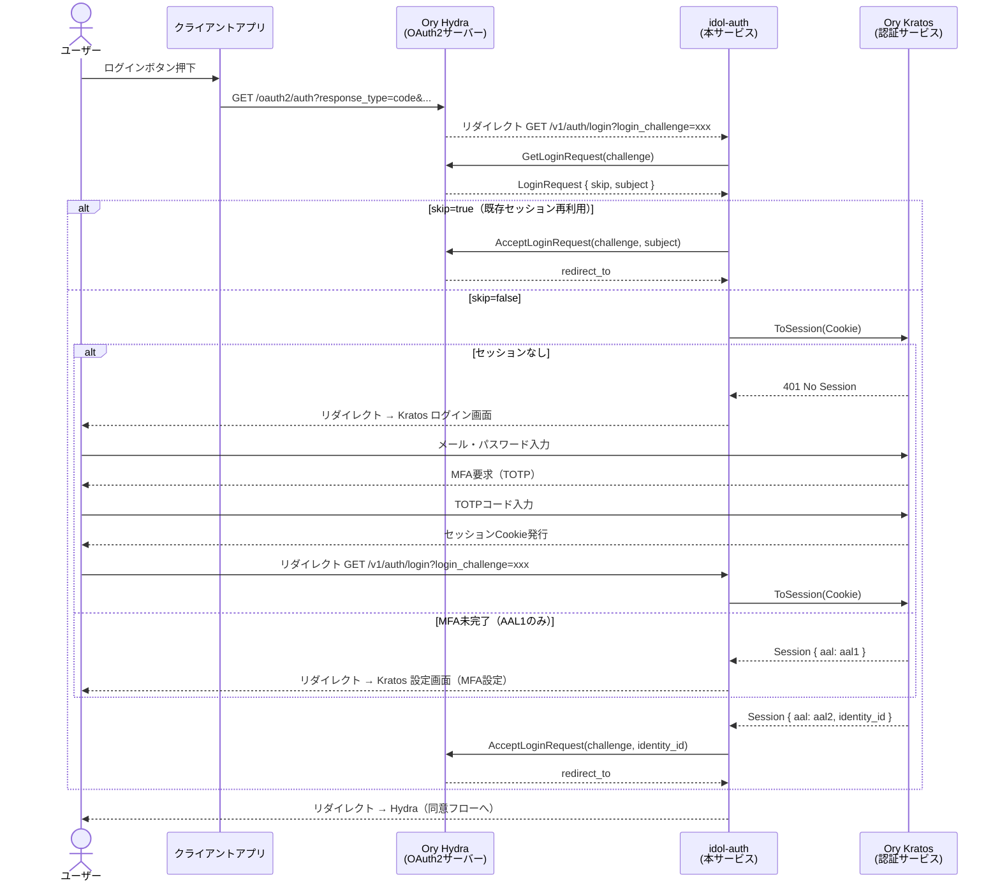
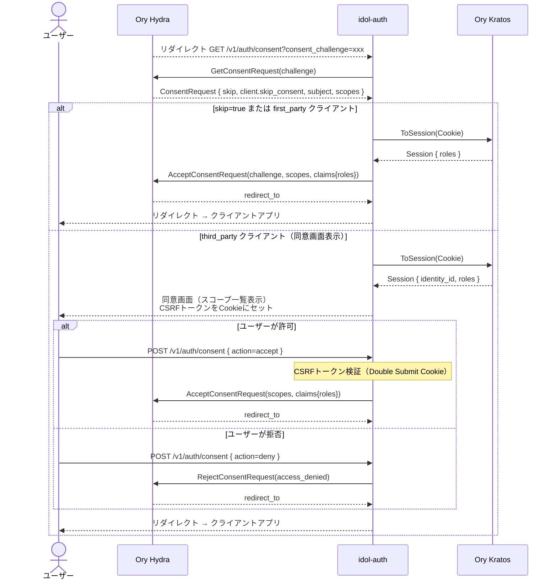
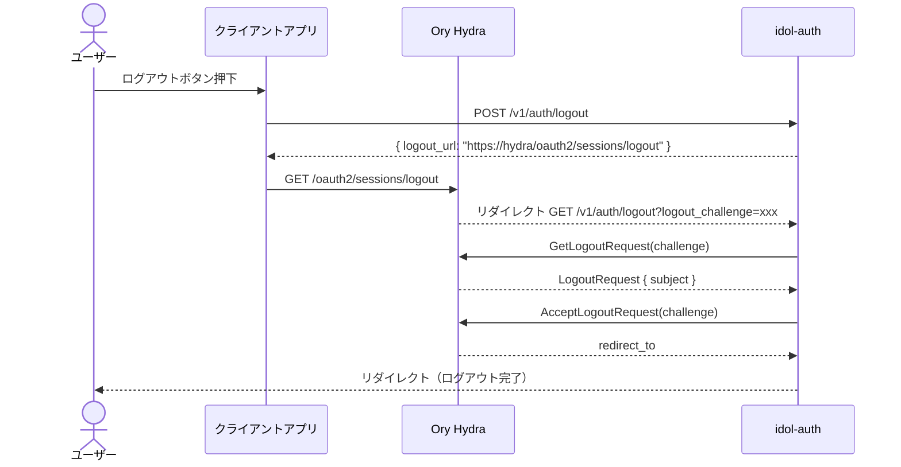
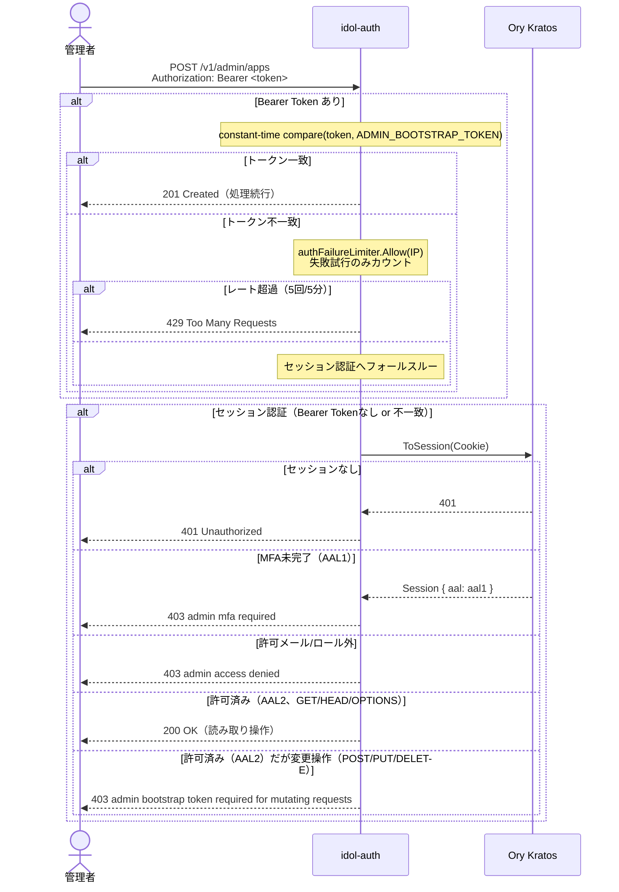
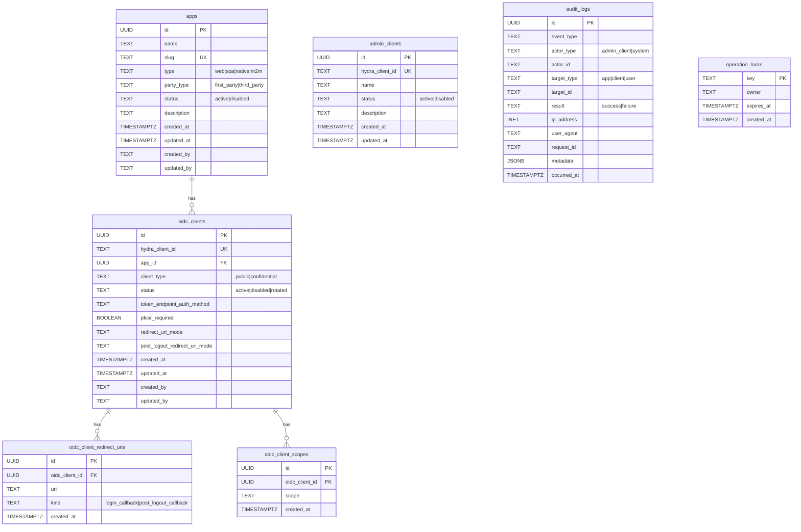

# Diagrams

## シーケンス図

### 1. ログインフロー（OAuth2 Authorization Code + PKCE）

```mermaid
sequenceDiagram
    actor User as ユーザー
    participant App as クライアントアプリ
    participant Hydra as Ory Hydra<br/>(OAuth2サーバー)
    participant Server as idol-auth<br/>(本サービス)
    participant Kratos as Ory Kratos<br/>(認証サービス)

    User->>App: ログインボタン押下
    App->>Hydra: GET /oauth2/auth?response_type=code&...
    Hydra-->>Server: リダイレクト GET /v1/auth/login?login_challenge=xxx

    Server->>Hydra: GetLoginRequest(challenge)
    Hydra-->>Server: LoginRequest { skip, subject }

    alt skip=true（既存セッション再利用）
        Server->>Hydra: AcceptLoginRequest(challenge, subject)
        Hydra-->>Server: redirect_to
    else skip=false
        Server->>Kratos: ToSession(Cookie)
        alt セッションなし
            Kratos-->>Server: 401 No Session
            Server-->>User: リダイレクト → Kratos ログイン画面
            User->>Kratos: メール・パスワード入力
            Kratos-->>User: MFA要求（TOTP）
            User->>Kratos: TOTPコード入力
            Kratos-->>User: セッションCookie発行
            User->>Server: リダイレクト GET /v1/auth/login?login_challenge=xxx
            Server->>Kratos: ToSession(Cookie)
        else MFA未完了（AAL1のみ）
            Kratos-->>Server: Session { aal: aal1 }
            Server-->>User: リダイレクト → Kratos 設定画面（MFA設定）
        end
        Kratos-->>Server: Session { aal: aal2, identity_id }
        Server->>Hydra: AcceptLoginRequest(challenge, identity_id)
        Hydra-->>Server: redirect_to
    end

    Server-->>User: リダイレクト → Hydra（同意フローへ）
```

### 2. 同意フロー（Consent）

```mermaid
sequenceDiagram
    actor User as ユーザー
    participant Hydra as Ory Hydra
    participant Server as idol-auth
    participant Kratos as Ory Kratos

    Hydra-->>Server: リダイレクト GET /v1/auth/consent?consent_challenge=xxx

    Server->>Hydra: GetConsentRequest(challenge)
    Hydra-->>Server: ConsentRequest { skip, client.skip_consent, subject, scopes }

    alt skip=true または first_party クライアント
        Server->>Kratos: ToSession(Cookie)
        Kratos-->>Server: Session { roles }
        Server->>Hydra: AcceptConsentRequest(challenge, scopes, claims{roles})
        Hydra-->>Server: redirect_to
        Server-->>User: リダイレクト → クライアントアプリ
    else third_party クライアント（同意画面表示）
        Server->>Kratos: ToSession(Cookie)
        Kratos-->>Server: Session { identity_id, roles }
        Server-->>User: 同意画面（スコープ一覧表示）<br/>CSRFトークンをCookieにセット

        alt ユーザーが許可
            User->>Server: POST /v1/auth/consent { action=accept }
            Note over Server: CSRFトークン検証（Double Submit Cookie）
            Server->>Hydra: AcceptConsentRequest(scopes, claims{roles})
            Hydra-->>Server: redirect_to
        else ユーザーが拒否
            User->>Server: POST /v1/auth/consent { action=deny }
            Server->>Hydra: RejectConsentRequest(access_denied)
            Hydra-->>Server: redirect_to
        end
        Server-->>User: リダイレクト → クライアントアプリ
    end
```

### 3. ログアウトフロー

```mermaid
sequenceDiagram
    actor User as ユーザー
    participant App as クライアントアプリ
    participant Hydra as Ory Hydra
    participant Server as idol-auth

    User->>App: ログアウトボタン押下
    App->>Server: POST /v1/auth/logout
    Server-->>App: { logout_url: "https://hydra/oauth2/sessions/logout" }
    App->>Hydra: GET /oauth2/sessions/logout
    Hydra-->>Server: リダイレクト GET /v1/auth/logout?logout_challenge=xxx

    Server->>Hydra: GetLogoutRequest(challenge)
    Hydra-->>Server: LogoutRequest { subject }
    Server->>Hydra: AcceptLogoutRequest(challenge)
    Hydra-->>Server: redirect_to

    Server-->>User: リダイレクト（ログアウト完了）
```

### 4. Admin API 認証フロー

```mermaid
sequenceDiagram
    actor Admin as 管理者
    participant Server as idol-auth
    participant Kratos as Ory Kratos

    Admin->>Server: POST /v1/admin/apps<br/>Authorization: Bearer <token>

    alt Bearer Token あり
        Note over Server: constant-time compare(token, ADMIN_BOOTSTRAP_TOKEN)
        alt トークン一致
            Server-->>Admin: 201 Created（処理続行）
        else トークン不一致
            Note over Server: authFailureLimiter.Allow(IP)<br/>失敗試行のみカウント
            alt レート超過（5回/5分）
                Server-->>Admin: 429 Too Many Requests
            else
                Note over Server: セッション認証へフォールスルー
            end
        end
    end

    alt セッション認証（Bearer Tokenなし or 不一致）
        Server->>Kratos: ToSession(Cookie)
        alt セッションなし
            Kratos-->>Server: 401
            Server-->>Admin: 401 Unauthorized
        else MFA未完了（AAL1）
            Kratos-->>Server: Session { aal: aal1 }
            Server-->>Admin: 403 admin mfa required
        else 許可メール/ロール外
            Server-->>Admin: 403 admin access denied
        else 許可済み（AAL2、GET/HEAD/OPTIONS）
            Server-->>Admin: 200 OK（読み取り操作）
        else 許可済み（AAL2）だが変更操作（POST/PUT/DELETE）
            Server-->>Admin: 403 admin bootstrap token required for mutating requests
        end
    end
```

---

## ER図

```mermaid
erDiagram
    apps {
        UUID id PK
        TEXT name
        TEXT slug UK
        TEXT type "web|spa|native|m2m"
        TEXT party_type "first_party|third_party"
        TEXT status "active|disabled"
        TEXT description
        TIMESTAMPTZ created_at
        TIMESTAMPTZ updated_at
        TEXT created_by
        TEXT updated_by
    }

    oidc_clients {
        UUID id PK
        TEXT hydra_client_id UK
        UUID app_id FK
        TEXT client_type "public|confidential"
        TEXT status "active|disabled|rotated"
        TEXT token_endpoint_auth_method
        BOOLEAN pkce_required
        TEXT redirect_uri_mode
        TEXT post_logout_redirect_uri_mode
        TIMESTAMPTZ created_at
        TIMESTAMPTZ updated_at
        TEXT created_by
        TEXT updated_by
    }

    oidc_client_redirect_uris {
        UUID id PK
        UUID oidc_client_id FK
        TEXT uri
        TEXT kind "login_callback|post_logout_callback"
        TIMESTAMPTZ created_at
    }

    oidc_client_scopes {
        UUID id PK
        UUID oidc_client_id FK
        TEXT scope
        TIMESTAMPTZ created_at
    }

    admin_clients {
        UUID id PK
        TEXT hydra_client_id UK
        TEXT name
        TEXT status "active|disabled"
        TEXT description
        TIMESTAMPTZ created_at
        TIMESTAMPTZ updated_at
    }

    audit_logs {
        UUID id PK
        TEXT event_type
        TEXT actor_type "admin_client|system"
        TEXT actor_id
        TEXT target_type "app|client|user"
        TEXT target_id
        TEXT result "success|failure"
        INET ip_address
        TEXT user_agent
        TEXT request_id
        JSONB metadata
        TIMESTAMPTZ occurred_at
    }

    operation_locks {
        TEXT key PK
        TEXT owner
        TIMESTAMPTZ expires_at
        TIMESTAMPTZ created_at
    }

    apps ||--o{ oidc_clients : "has"
    oidc_clients ||--o{ oidc_client_redirect_uris : "has"
    oidc_clients ||--o{ oidc_client_scopes : "has"
```

## クラス図

```mermaid
classDiagram
    %% ─── Domain Entities ───────────────────────────────────────
    class App {
        +UUID ID
        +string Name
        +string Slug
        +AppType Type
        +PartyType PartyType
        +AppStatus Status
        +string Description
        +time.Time CreatedAt
        +time.Time UpdatedAt
    }

    class OIDCClient {
        +UUID ID
        +string HydraClientID
        +UUID AppID
        +ClientType ClientType
        +ClientStatus Status
        +string TokenEndpointAuthMethod
        +bool PKCERequired
        +[]string RedirectURIs
        +[]string PostLogoutRedirectURIs
        +[]string Scopes
    }

    class AuditLog {
        +UUID ID
        +string EventType
        +ActorType ActorType
        +string ActorID
        +TargetType TargetType
        +string TargetID
        +Result Result
        +string IPAddress
        +string UserAgent
        +json.RawMessage Metadata
        +time.Time OccurredAt
    }

    class Identity {
        +string ID
        +string SchemaID
        +IdentityState State
        +string Email
        +string Phone
        +[]string Roles
    }

    %% ─── Repository Interfaces ──────────────────────────────────
    class AppRepository {
        <<interface>>
        +Create(ctx, App) App
        +List(ctx) []App
        +GetByID(ctx, UUID) App
    }

    class OIDCClientRepository {
        <<interface>>
        +Create(ctx, OIDCClient) OIDCClient
        +ListByAppID(ctx, UUID) []OIDCClient
    }

    class ClientProvisioner {
        <<interface>>
        +CreateClient(ctx, ClientProvisionSpec) ProvisionedClient
        +DeleteClient(ctx, clientID) error
    }

    class AuditRepository {
        <<interface>>
        +Write(ctx, Log) error
        +List(ctx, ListParams) []Log
    }

    class IdentityManager {
        <<interface>>
        +SetIdentityRoles(ctx, id, roles)
        +SearchIdentities(ctx, input) []Identity
        +DisableIdentity(ctx, input) Identity
        +EnableIdentity(ctx, input) Identity
        +RevokeIdentitySessions(ctx, id)
        +DeleteIdentity(ctx, id)
    }

    %% ─── Domain Services ────────────────────────────────────────
    class AppService {
        -AppRepository apps
        -OIDCClientRepository clients
        -AuditRepository auditLogs
        -ClientProvisioner provisioner
        +CreateApp(ctx, input) App
        +ListApps(ctx) []App
        +CreateOIDCClient(ctx, appID, input) ClientRegistration
        +ListOIDCClients(ctx, appID) []OIDCClient
    }

    class AdminService {
        -AppManager apps
        -IdentityManager identities
        -AuditRepository auditLogs
        +CreateApp(ctx, input) App
        +ListApps(ctx) []App
        +CreateOIDCClient(ctx, appID, input) ClientRegistration
        +SetIdentityRoles(ctx, input) []string
        +DisableIdentity(ctx, input) Identity
        +EnableIdentity(ctx, input) Identity
        +RevokeIdentitySessions(ctx, input)
        +DeleteIdentity(ctx, input)
        +ListAuditLogs(ctx, input) []AuditLog
    }

    %% ─── HTTP / Auth Layer ──────────────────────────────────────
    class AuthService {
        <<interface>>
        +HandleLogin(ctx, r, challenge) LoginFlowResult
        +HandleConsent(ctx, r, challenge) ConsentFlowResult
        +SubmitConsent(ctx, r, challenge, input) AuthFlowResult
        +HandleLogout(ctx, challenge) AuthFlowResult
        +CurrentSession(ctx, r) SessionView
    }

    class authService {
        -string baseURL
        -HydraAuthClient hydra
        -KratosAuthClient kratos
        +HandleLogin()
        +HandleConsent()
        +SubmitConsent()
        +HandleLogout()
        +CurrentSession()
    }

    class HydraAuthClient {
        <<interface>>
        +GetLoginRequest(ctx, challenge)
        +AcceptLoginRequest(ctx, challenge, subject)
        +GetConsentRequest(ctx, challenge)
        +AcceptConsentRequest(ctx, challenge, ...)
        +RejectConsentRequest(ctx, challenge, ...)
        +GetLogoutRequest(ctx, challenge)
        +AcceptLogoutRequest(ctx, challenge)
    }

    class KratosAuthClient {
        <<interface>>
        +ToSession(ctx, r) KratosSession
        +BrowserLoginURL(returnTo) string
        +BrowserSettingsURL(returnTo) string
    }

    %% ─── Relationships ──────────────────────────────────────────
    App "1" --> "many" OIDCClient : owns

    AppService ..|> AppRepository : uses
    AppService ..|> OIDCClientRepository : uses
    AppService ..|> ClientProvisioner : uses
    AppService ..|> AuditRepository : uses

    AdminService ..|> AuditRepository : uses
    AdminService --> AppService : delegates to
    AdminService ..|> IdentityManager : uses

    authService ..|> AuthService : implements
    authService ..|> HydraAuthClient : uses
    authService ..|> KratosAuthClient : uses

    AuditLog --> AuditRepository : persisted via
```
