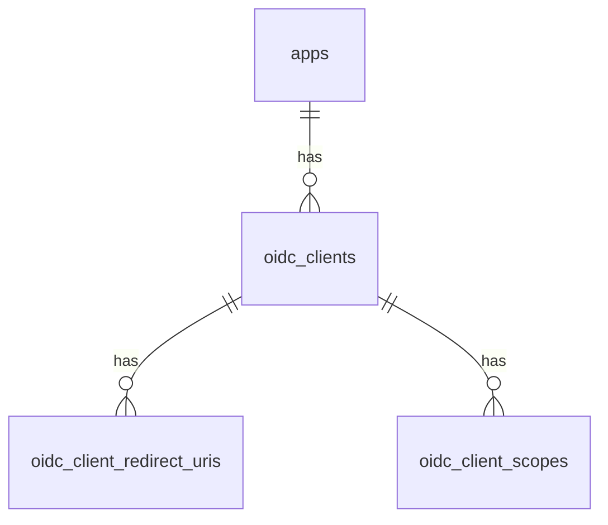

# Data Model Design

## 1. Purpose

この文書は初期リリースに必要なデータモデルを定義する。

前提:

- 認証の中核データは Ory Kratos / Hydra が管理する
- Go アプリは auth facade / admin API として必要な補助データを保持する
- 共通認証基盤は認証専用であり、広い個人情報は保持しない

## 2. Ownership Split

### 2.1 Ory-managed data

Ory 側に持たせるデータ。

- identity
- primary identifier
- password credential
- verification state
- recovery state
- TOTP enrollment
- browser / auth session
- OAuth / OIDC client core data
- token / consent / login challenge related state

### 2.2 Go-managed data

Go 側で持つデータ。

- app registry
- app to client mapping
- admin operator
- admin role binding
- audit log
- operational metadata

## 3. Design Principles

- Ory が保持できる認証データは重複保存しない
- Go 側 DB は control plane データに限定する
- 個人情報は持たないか、持っても最小限にする
- app ごとの設定を中央で管理する
- 監査可能性を優先し、重要操作はイベントとして保存する

## 4. Logical Entities

初期リリースで必要な論理エンティティは以下。

- app
- oidc_client
- app_client_binding
- admin_user
- admin_role
- admin_user_role
- audit_log
- operation_lock

## 5. Entity Definitions

### 5.1 `apps`

認証基盤に接続するアプリケーションの登録情報。

主な目的:

- どのアプリが共通認証基盤を利用するかを管理する
- first-party / third-party を識別する
- アプリごとの運用状態を持つ

推奨カラム:

| Column | Type | Notes |
|---|---|---|
| `id` | UUID | primary key |
| `name` | text | 表示名 |
| `slug` | text | 一意なアプリ識別子 |
| `type` | text | `web`, `spa`, `native`, `m2m` など |
| `party_type` | text | `first_party`, `third_party` |
| `status` | text | `active`, `disabled` |
| `description` | text nullable | 任意説明 |
| `created_at` | timestamptz | 作成日時 |
| `updated_at` | timestamptz | 更新日時 |
| `created_by` | UUID nullable | admin user id |
| `updated_by` | UUID nullable | admin user id |

制約:

- `slug` は一意
- `status` は列挙制約
- `party_type` は列挙制約

### 5.2 `oidc_clients`

Hydra の OAuth / OIDC client に対応するアプリ管理テーブル。

主な目的:

- Hydra の client と運用メタデータを関連づける
- confidential/public を識別する
- secret rotation や無効化の監査対象にする

推奨カラム:

| Column | Type | Notes |
|---|---|---|
| `id` | UUID | primary key |
| `hydra_client_id` | text | Hydra client id |
| `app_id` | UUID | FK to apps |
| `client_type` | text | `public`, `confidential` |
| `status` | text | `active`, `disabled`, `rotated` |
| `token_endpoint_auth_method` | text | Hydra 設定との整合用 |
| `pkce_required` | boolean | public client は true 前提 |
| `redirect_uri_mode` | text | `strict` 固定想定 |
| `post_logout_redirect_uri_mode` | text | `strict` 固定想定 |
| `created_at` | timestamptz | 作成日時 |
| `updated_at` | timestamptz | 更新日時 |
| `created_by` | UUID nullable | admin user id |
| `updated_by` | UUID nullable | admin user id |

制約:

- `hydra_client_id` は一意
- `app_id` に FK

### 5.3 `oidc_client_redirect_uris`

client ごとの redirect URI 設定。

推奨カラム:

| Column | Type | Notes |
|---|---|---|
| `id` | UUID | primary key |
| `oidc_client_id` | UUID | FK to oidc_clients |
| `uri` | text | strict match で扱う |
| `kind` | text | `login_callback`, `post_logout_callback` |
| `created_at` | timestamptz | 作成日時 |

制約:

- `oidc_client_id + uri + kind` は一意

### 5.4 `oidc_client_scopes`

client ごとの許可 scope。

推奨カラム:

| Column | Type | Notes |
|---|---|---|
| `id` | UUID | primary key |
| `oidc_client_id` | UUID | FK to oidc_clients |
| `scope` | text | 例 `openid`, `offline_access` |
| `created_at` | timestamptz | 作成日時 |

制約:

- `oidc_client_id + scope` は一意

### 5.5 `admin_clients`

Admin API を呼び出す M2M クライアントの管理テーブル。

主な目的:

- Hydra の admin client と運用メタデータを関連づける
- 監査ログの actor 情報として使用する
- 有効化・無効化・secret rotation の追跡

推奨カラム:

| Column | Type | Notes |
|---|---|---|
| `id` | UUID | primary key |
| `hydra_client_id` | text | Hydra client id（一意） |
| `name` | text | 管理用の識別名 |
| `status` | text | `active`, `disabled` |
| `description` | text nullable | 任意 |
| `created_at` | timestamptz | 作成日時 |
| `updated_at` | timestamptz | 更新日時 |

制約:

- `hydra_client_id` は一意
- `status` は列挙制約

備考:

- Admin client の認可はスコープで管理する（DB 側に role テーブルは持たない）
- スコープ定義は system-design.md セクション 15.2 を参照

### 5.8 `audit_logs`

重要操作の監査ログ。

主な目的:

- 誰が何をいつ行ったかを追跡する
- ユーザー停止や client 作成などの証跡を残す

推奨カラム:

| Column | Type | Notes |
|---|---|---|
| `id` | UUID | primary key |
| `event_type` | text | 例 `app.created`, `user.disabled` |
| `actor_type` | text | `admin_user`, `system` |
| `actor_id` | text | UUID or system id |
| `target_type` | text | `app`, `client`, `user` |
| `target_id` | text | target identifier |
| `result` | text | `success`, `failure` |
| `ip_address` | inet nullable | 発信元 IP |
| `user_agent` | text nullable | UA |
| `request_id` | text nullable | 相関 ID |
| `metadata` | jsonb | 追加情報 |
| `occurred_at` | timestamptz | 発生日時 |

インデックス候補:

- `event_type`
- `actor_type, actor_id`
- `target_type, target_id`
- `occurred_at`

### 5.9 `operation_locks`

重複実行や競合を避けるための軽量ロック。

初期リリースから必須。MFA 設定変更・パスワードリセット・セッション失効などの状態変更操作で
TOCTOU 競合が発生しうるため、分散環境でのアカウント乗っ取りリスクを防ぐ。

推奨カラム:

| Column | Type | Notes |
|---|---|---|
| `key` | text | primary key |
| `owner` | text | lock owner |
| `expires_at` | timestamptz | 期限 |
| `created_at` | timestamptz | 作成日時 |

## 6. Suggested ER View

## 7. Ory Identity Schema Guidance

Ory 側 identity schema は最小限に留める。

推奨プロパティ:

- `primary_identifier_type`
- `email` nullable
- `phone` nullable
- `account_status`

注意:

- 氏名や住所などは原則含めない
- 複数アプリ共通で不要な個人情報は schema に入れない
- 認証に不要なプロフィールを identity schema に混ぜない

## 8. Status Enumerations

### 8.1 App status

- `active`
- `disabled`

### 8.2 Client status

- `active`
- `disabled`
- `rotated`

### 8.3 Admin user status

- `active`
- `disabled`

### 8.4 Audit result

- `success`
- `failure`

## 9. Retention and Compliance Guidance

- audit log は削除より retention policy で管理する
- client secret の平文は Go 側 DB に保存しない
- 個人情報を audit metadata に含めすぎない
- request body 全文保存は避ける

## 10. Migration Strategy

- Go 側 DB スキーマは migration tool で管理する
- Ory の schema / config 変更と Go 側 migration は分離して扱う
- 初期リリースでは破壊的変更を避けるため additive migration を優先する

## 11. Recommended Next Step

次は以下を決める。

1. Go プロジェクトのディレクトリ構成
2. 使用ライブラリ
3. 設定管理方式
4. migration tool
5. Docker Compose のサービス分割
