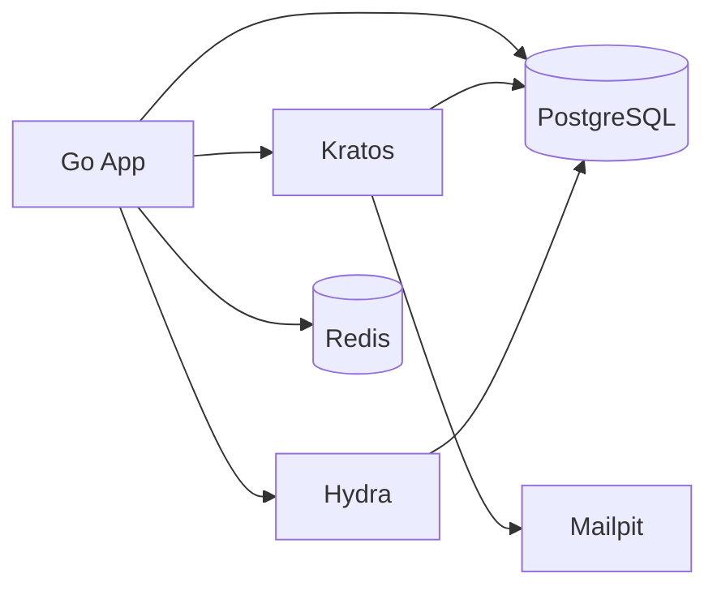

# Local Development Bootstrap Design

## 1. Purpose

この文書は初期実装に向けたローカル開発環境の構成を定義する。

対象:

- Docker Compose サービス構成
- 起動順
- ローカル開発時の責務分離
- 初回 bootstrap 方針

## 2. Goals

- 1 コマンドで認証基盤のローカル環境を起動できる
- Go アプリ、Kratos、Hydra、PostgreSQL を一貫した構成で立ち上げる
- 初期リリースの主要フローをローカルで検証できる

## 3. Compose Services

初期リリースでは以下のサービスを持つ。

| Service | Purpose |
|---|---|
| `app` | Go Auth Facade / Admin API |
| `postgres` | 共通 DB |
| `redis` | rate limit / short-lived state |
| `kratos-migrate` | Kratos schema migration |
| `kratos` | identity and authentication |
| `hydra-migrate` | Hydra schema migration |
| `hydra` | OAuth2 / OIDC / SSO |
| `migrate` | Go 側 DB migration |
| `mailpit` | ローカルメール検証 |

補足:

- phone を primary identifier にする場合でも、初期段階では SMS 実配信は不要
- phone verification は後続で stub / mock provider から入れる
- 現時点の要件では MFA は TOTP のみなので、SMS provider は必須ではない

## 4. Suggested Service Topology

## 5. Startup Order

推奨順序:

1. `postgres`
2. `redis`
3. `kratos-migrate`
4. `hydra-migrate`
5. `migrate`
6. `kratos`
7. `hydra`
8. `app`

理由:

- DB schema 未適用のまま Ory を起動しない
- Go 側 migration も app 起動前に済ませる

## 6. Port Strategy

ローカルでは役割ごとにポートを分ける。

推奨:

| Service | Port |
|---|---|
| `app` | `8080` |
| `kratos public` | `4433` |
| `kratos admin` | `4434` |
| `hydra public` | `4444` |
| `hydra admin` | `4445` |
| `mailpit ui` | `8025` |
| `mailpit smtp` | `1025` |
| `postgres` | `5432` |
| `redis` | `6379` |

## 7. Config Files

### 7.1 Go app

- `.env.example`
- `deploy/docker/app.env`

### 7.2 Kratos

- `deploy/kratos/kratos.yml`
- `deploy/kratos/identity.schema.json`

### 7.3 Hydra

- `deploy/hydra/hydra.yml`

### 7.4 Compose

- `docker-compose.yml`

## 8. Bootstrap Tasks

初回 bootstrap で必要な作業:

1. Go module 初期化
2. DB migration 雛形作成
3. Kratos 設定作成
4. Hydra 設定作成
5. login / consent 用の Go 側 callback route の雛形作成
6. first-party サンプル client の登録手順作成

## 9. Local Verification Targets

ローカル起動後、最低限確認できる状態:

- `GET /healthz` が 200
- Kratos registration flow 初期化が通る
- Kratos login flow 初期化が通る
- TOTP enrollment 設定画面まで到達できる
- Hydra discovery endpoint が応答する
- サンプル app client で authorization code flow が開始できる

## 10. Development Workflow

推奨ワークフロー:

1. `docker compose up` で依存起動
2. Go アプリはホットリロードなしでも良いので単純起動
3. migration を明示実行
4. 手動と integration test で疎通確認

初期は単純さ優先でよい。ホットリロードや複雑な開発支援は後で足す。

## 11. Seed Strategy

初期リリースのローカル検証用に seed を持つ。

候補:

- platform admin 1 件
- sample app A client
- sample app B client

重要:

- production 用 seed と混在させない
- secret を seed ファイルへ固定で書かない

## 12. Risks and Mitigations

### 12.1 Risk: Ory 設定が複雑

対策:

- Kratos / Hydra config を deploy 配下に固定する
- 初期は要件外の認証手段を入れない

### 12.2 Risk: ローカル SSO 検証が複雑

対策:

- sample clients を 2 つ用意する
- redirect URI を localhost で明示登録する

### 12.3 Risk: migration 順序で失敗

対策:

- migrate container を分離する
- readiness と depends_on を使う

## 13. Recommended First Implementation Slice

最初の実装単位はこれが妥当。

1. `docker-compose.yml`
2. `deploy/kratos/kratos.yml`
3. `deploy/kratos/identity.schema.json`
4. `deploy/hydra/hydra.yml`
5. `cmd/server/main.go`
6. `internal/config`
7. `internal/http/router.go`
8. `GET /healthz`

ここまでで、環境起動とアプリ雛形の双方が確認できる。
