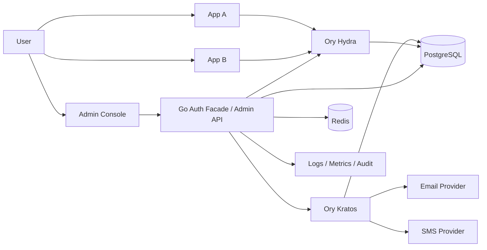
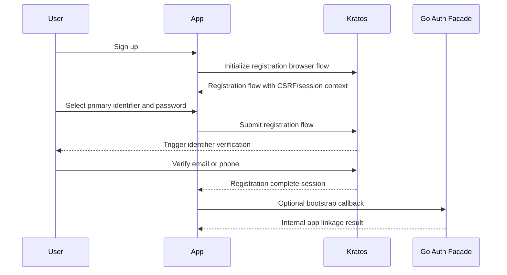
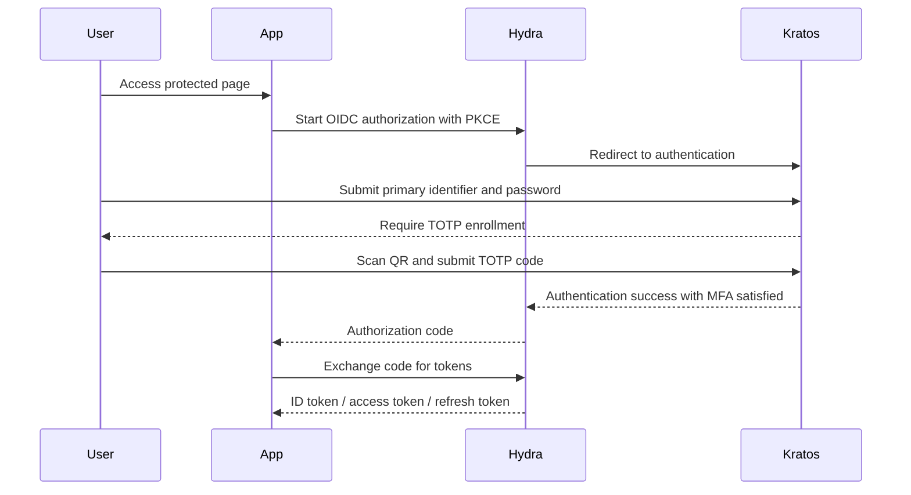
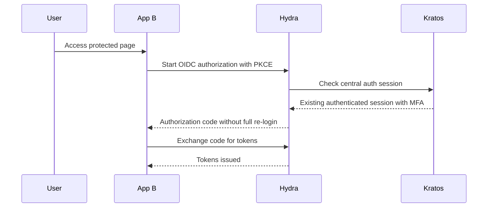
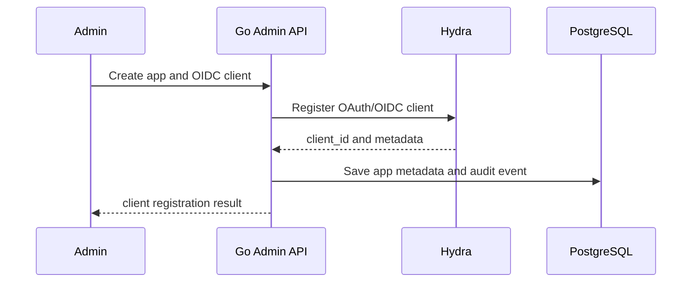
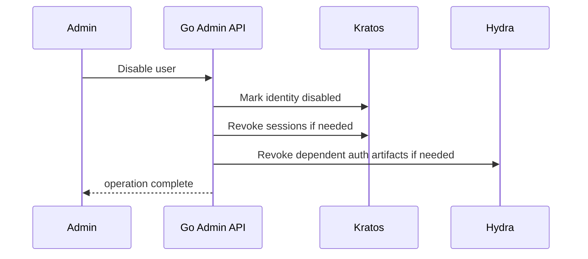

# System Design

## 1. Purpose

この文書は初期リリース要件を実装可能な設計へ落とすための詳細設計である。

対象は以下の 3 点。

- 構成図
- 認証フロー
- API 一覧

前提要件は [initial-release-requirements.md](/Users/ryunosukekurokawa/Documents/my_products/web_services/idol-auth/plans/initial-release-requirements.md) に従う。

## 2. Architecture Overview

初期リリースでは、Go アプリは認証の中核を実装しない。
Go アプリは以下の責務を持つ。

- 管理 API の提供
- Ory Kratos / Hydra の統合
- login / consent 連携
- client 管理
- 監査ログ集約
- 各アプリ向け共通認証運用 API

認証と認可の中核責務は以下に委譲する。

- Kratos: アカウント登録、ログイン、セッション、MFA、識別子検証
- Hydra: OAuth2 / OIDC、SSO、token 発行、client 管理の中核

## 3. Component Diagram



## 4. Trust Boundary

### 4.1 Public boundary

インターネットから到達可能な面。

- 各アプリのフロントエンド
- Go Auth Facade の公開エンドポイント
- Kratos / Hydra の公開エンドポイント

### 4.2 Protected internal boundary

内部通信または管理用途に限定する。

- Kratos Admin API
- Hydra Admin API
- Go 管理 API
- PostgreSQL
- Redis
- 監査ログ送信先

### 4.3 Sensitive data boundary

高リスク情報は以下に限定して扱う。

- password credential
- TOTP secret
- session
- OAuth client secret
- 監査ログ

## 5. Data Ownership

### 5.1 Shared auth platform owns

- user id
- primary identifier
- identifier verification state
- password credential
- MFA enrollment state
- TOTP secret
- session state
- OAuth / OIDC client metadata
- auth audit logs

### 5.2 Each app owns

- 氏名
- 住所
- 生年月日
- 業務プロフィール
- 同意情報
- 業務権限
- アプリ固有設定

## 6. Identifier Model

- primary identifier は `email` または `phone` のどちらか一方
- 1 アカウントに設定できる primary は 1 つのみ
- 登録時にユーザーが選択する
- 選択された identifier は検証必須
- 初期リリースでは認証トークンに identifier を原則含めない

## 7. Authentication and SSO Design

### 7.1 Standard browser login

- 各アプリは OIDC client として Hydra に接続する
- フローは `Authorization Code + PKCE`
- ユーザー認証そのものは Kratos が担当する
- 認証済みセッションを使って Hydra が SSO を成立させる

### 7.2 Required MFA

- ログイン成功条件に TOTP 完了を含める
- password 正答だけでは認証完了としない
- TOTP 未登録ユーザーは初回ログイン直後に enrollment flow へ遷移させる

### 7.3 Minimal claims

初期リリースで各アプリへ渡す claims は最小化する。

- `sub`
- `amr`
- `auth_time`
- 必要最小限のセッション文脈

以下は初期リリースでは標準 claims に含めない。

- email
- phone_number
- profile
- address

## 8. User Flows

### 8.1 Registration flow



### 8.2 First login with MFA enrollment



### 8.3 Subsequent login with SSO



### 8.4 Login without SSO

比較のために記載する。初期リリースでは採用しない。

- App A にログインしても App B では未認証
- App B で password と MFA を再度要求しやすい
- 共通アカウントはあってもセッション共有が成立しない

### 8.5 Logout policy

初期リリースでは以下を採用する。

- 各アプリからの logout は中央認証セッションにも反映する
- 可能な限り central logout を実行する
- app 側 local session も同時に破棄する

詳細な front-channel / back-channel logout は後続設計で詰める。

## 9. Admin Flows

### 9.1 Create app client



### 9.2 Disable user



## 10. API Design Principles

- 外部公開 API と内部管理 API を分離する
- Go アプリの API は auth facade と admin control plane に限定する
- OIDC discovery や authorize/token の本体は Hydra に委譲する
- Kratos / Hydra Admin API を外部へ直接公開しない
- API は原則 JSON
- エラーは機密情報を漏らさない

## 11. API Catalog

### 11.1 Public auth-adjacent APIs exposed by Go

直接認証そのものを処理するのではなく、認証基盤の運用補助と連携に使う。

| Method | Path | Purpose | Auth |
|---|---|---|---|
| GET | `/healthz` | liveness check | none |
| GET | `/readyz` | readiness check | none |
| GET | `/v1/auth/session` | 現在セッションの認証状態確認 | user session |
| POST | `/v1/auth/logout` | central logout の開始 | user session |
| GET | `/v1/auth/providers` | 利用可能な認証手段の取得 | none |

### 11.2 Admin APIs

| Method | Path | Purpose | Auth |
|---|---|---|---|
| POST | `/v1/admin/apps` | アプリ登録 | admin |
| GET | `/v1/admin/apps` | アプリ一覧取得 | admin |
| GET | `/v1/admin/apps/{appId}` | アプリ詳細取得 | admin |
| PATCH | `/v1/admin/apps/{appId}` | アプリ設定更新 | admin |
| POST | `/v1/admin/apps/{appId}/clients` | OIDC client 作成 | admin |
| GET | `/v1/admin/apps/{appId}/clients` | client 一覧取得 | admin |
| POST | `/v1/admin/clients/{clientId}/rotate-secret` | confidential client secret のローテーション | admin |
| POST | `/v1/admin/clients/{clientId}/disable` | client 無効化 | admin |
| GET | `/v1/admin/users` | ユーザー検索 | admin |
| GET | `/v1/admin/users/{userId}` | ユーザー詳細取得 | admin |
| POST | `/v1/admin/users/{userId}/disable` | ユーザー停止 | admin |
| POST | `/v1/admin/users/{userId}/enable` | ユーザー再有効化 | admin |
| POST | `/v1/admin/users/{userId}/revoke-sessions` | セッション失効 | admin |
| GET | `/v1/admin/audit-logs` | 監査ログ検索 | admin |

### 11.3 OIDC / OAuth endpoints delegated to Hydra

| Method | Path | Purpose |
|---|---|---|
| GET | `/.well-known/openid-configuration` | OIDC discovery |
| GET | `/oauth2/auth` | authorization endpoint |
| POST | `/oauth2/token` | token endpoint |
| POST | `/oauth2/revoke` | token revoke |
| GET | `/oauth2/sessions/logout` | logout-related endpoint set |
| GET | `/userinfo` | userinfo |
| GET | `/.well-known/jwks.json` | JWKS |

### 11.4 Identity endpoints delegated to Kratos

Kratos の self-service flow を利用する前提。

| Flow | Example endpoint |
|---|---|
| registration | `/self-service/registration/browser` |
| login | `/self-service/login/browser` |
| settings | `/self-service/settings/browser` |
| recovery | `/self-service/recovery/browser` |
| verification | `/self-service/verification/browser` |
| logout | `/self-service/logout/browser` |

## 12. API Data Shape Guidance

### 12.1 App registration

入力項目候補:

- app name
- app type
- first-party / third-party
- allowed redirect uris
- allowed post logout redirect uris
- allowed scopes

### 12.2 User search

検索条件候補:

- user id
- primary identifier exact match
- status
- MFA enrolled or not
- created at range

### 12.3 Audit log query

検索条件候補:

- actor type
- actor id
- action
- target type
- target id
- timestamp range

## 13. Security Controls in Design

- browser-based app に API flow を使わない
- PKCE を mandatory にする
- redirect URI を厳格一致で管理する
- token claims を最小化する
- admin API は別認可境界で保護する
- Kratos / Hydra の admin endpoint は private network に限定する
- central session と app local session の両方を明示的に扱う

## 14. Open Questions for Next Design Pass

- App local session を cookie のみにするか
- global logout の厳密な挙動
- userinfo endpoint を公開するか最小化するか
- app metadata を Go 側 DB にどこまで持つか

## 15. Admin API Authentication Design (M2M)

### 15.1 Approach

Admin API の呼び出し元はすべてサービス（M2M）とする。
人間が直接 Admin API を叩くユースケースは初期リリースのスコープ外。

認証方式: `client_credentials` grant (Hydra)

- 各 admin サービスは Hydra に confidential client として登録する
- `client_credentials` で access token を取得し、Admin API の `Authorization: Bearer` ヘッダに付与する
- Go Admin API は Hydra の token introspection endpoint でトークンを検証する
- スコープが認可の単位となる

### 15.2 Admin Scopes

初期リリースで定義するスコープ:

| Scope | 許可操作 |
|---|---|
| `admin:apps:read` | アプリ一覧・詳細取得 |
| `admin:apps:write` | アプリ登録・更新・停止 |
| `admin:clients:read` | OIDC client 一覧・詳細取得 |
| `admin:clients:write` | client 作成・secret ローテーション・無効化 |
| `admin:users:read` | ユーザー検索・詳細取得 |
| `admin:users:write` | ユーザー停止・再有効化・セッション失効 |
| `admin:audit:read` | 監査ログ検索 |

### 15.3 Admin Client Registration

- Admin client は Go Admin API 経由ではなく、初期セットアップスクリプトで Hydra に直接登録する
- `client_credentials` grant のみを許可（authorization_code は付与しない）
- `redirect_uris` は不要（設定しない）
- client secret は secret manager で管理し、ソースコードに含めない

### 15.4 Token Validation Flow

```
Admin Service → (client_credentials) → Hydra → access token
Admin Service → (Bearer token) → Go Admin API
Go Admin API → (introspect) → Hydra → { active, scope, client_id }
Go Admin API → scope check → authorized / 403
```

### 15.5 Audit Log Actor for M2M

監査ログの `actor_type` は `admin_client`、`actor_id` は Hydra の `client_id` を使用する。
`admin_users` テーブルは初期リリースでは不要（M2M のみのため）。

### 15.6 Security Notes

- Introspection endpoint は internal boundary にのみ公開する
- Admin client の token lifetime は短く設定する（推奨: 5 分以下）
- 各 admin サービスは必要最小限のスコープのみ付与する（最小権限）
- Admin client の secret rotation 手順をオペレーションドキュメントに記載する
